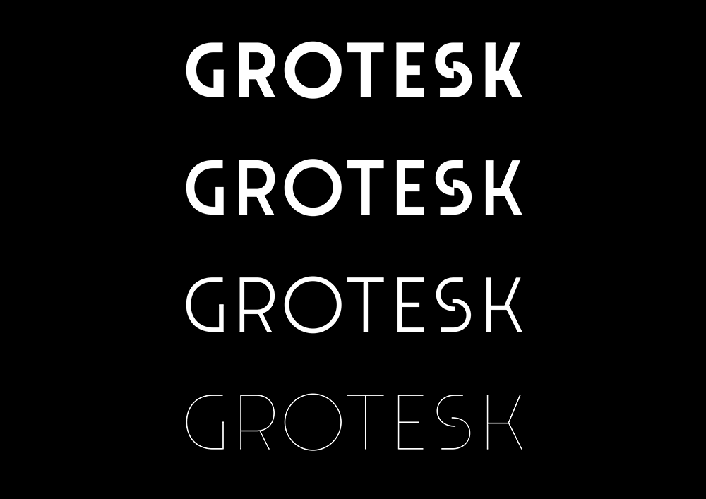
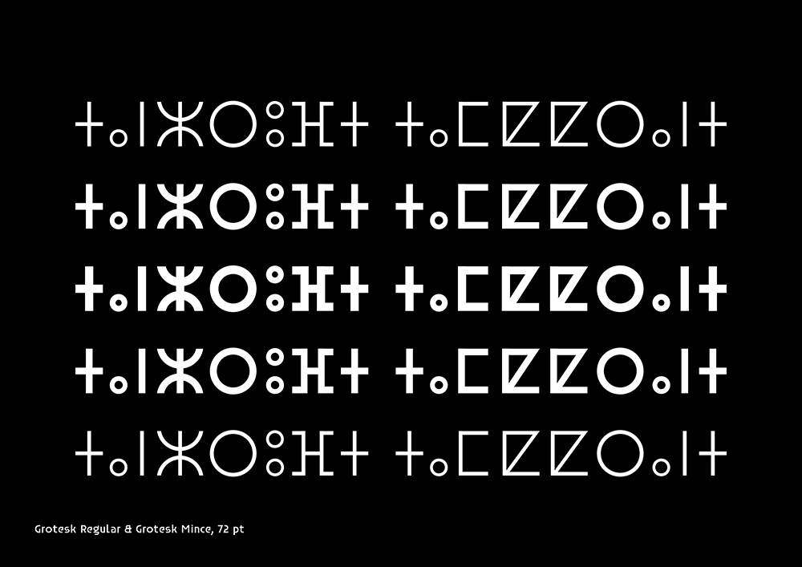
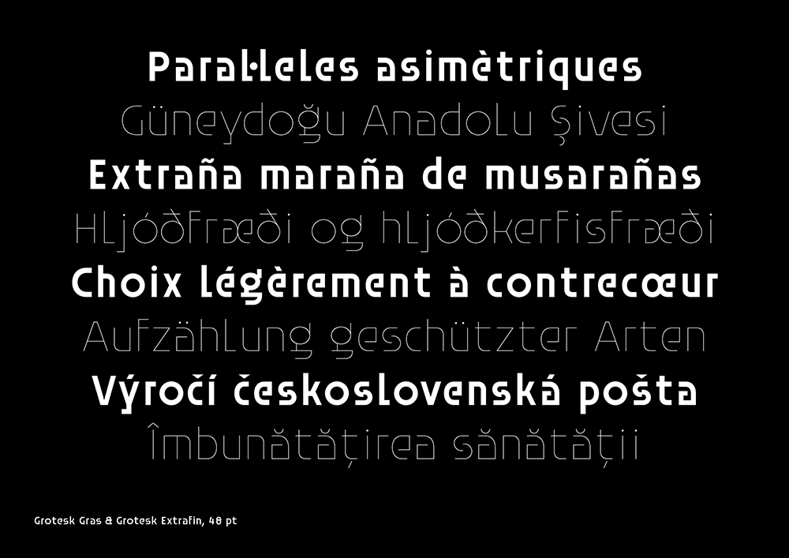
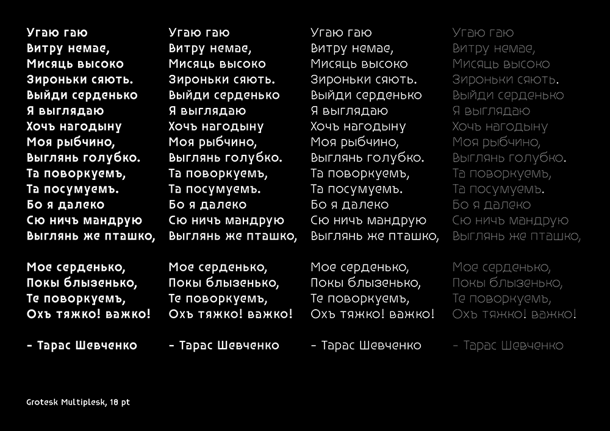
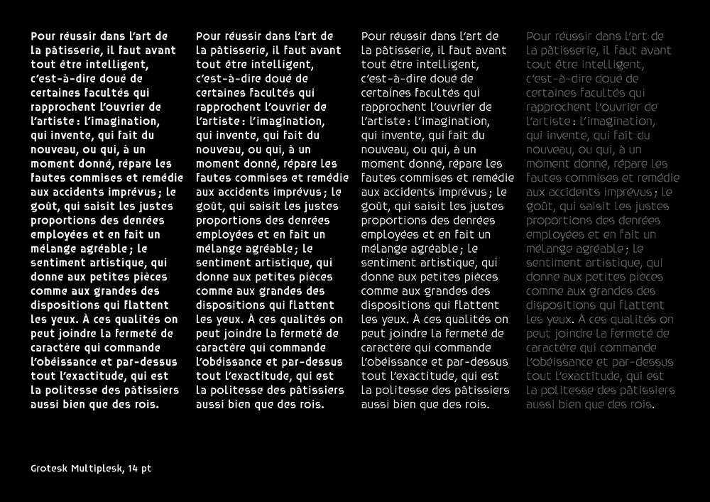

# Grotesk

<strong>[EN]</strong>

Grotesk is one of [Velvetyne's](https://velvetyne.fr/) first published typefaces. Designed by [Frank Adebiaye](https://www.fadebiaye.com/) in 2010 and released on Velvetyne in 2012, Grotesk is a heavily geometric sans serif typeface with an unusually large spacing. The original version of Grotesk is known because it was used on the official website of the city of Paris for many years. Even if the city's visual identity has changed since then, the broken "S" of Grotesk can still be seen in some of the technical vehicles of the city.

In 2023, a new version of Grotesk developed by [Ariel Martín Pérez](https://appliedmetaprojects.com/) was released. This new version introduces new weights that are multiplexed, which means that you can change the weight of the font without changing the width of the paragraphs. This new version also presents some subtle optical corrections. Last but not least, it considerably expands the glyphset of the font with a brand new lowercase set as well as language support for Russian, Ukrainian, Tifinagh and many Latin-based languages.

You can use Grotesk to give a relaxed and elegant touch to your texts, its subtle art-déco flavour will enlighten any composition.

<strong>[EN]</strong>

Grotesk est l'une des premières fontes publiées sur [Velvetyne](https://velvetyne.fr/). Dessinée par [Frank Adebiaye](https://www.fadebiaye.com/) en 2010 et publiée sur le site de Velvetyne en 2012, Grotesk est un caractère sans empattements fortement géométrique, qui présente un espacement étrangement large. La version originale du Grotesk s'est fait connaître parce que pendant longtemps elle a été visible sur le logotype du site officiel de la ville de Paris. Même si l'identité visuelle de la ville a changé dès lors, le "S" cassé de Grotesk est encore visible dans quelques-uns des véhicules techniques de la ville.

En 2023, une nouvelle version du Grotesk a été publiée, développée par [Ariel Martín Pérez](https://appliedmetaprojects.com/). Cette nouvelle version introduit des nouvelles graisses en mode multiplexage, ce qui veux dire que vous pouvez changer la graisse de la fonte sans faire varier la chasse du texte. Cette nouvelle version présente aussi quelques corrections optiques. Enfin et surtout, elle augmente considérablement le set de caractères de la fonte avec des nouvelles bas de casse et du support linguistique pour  le russe, l'ukrainien, le tifinagh et des nombreuses langues basées sur l'alphabet latin.

Vous pouvez utiliser le Grotesk pour donner une allure élégante et décontractée à vos textes, son arôme subtilement art-déco saura relever toutes vos compositions.

## Specimen

## License

This Font Software is licensed under the SIL Open Font License, Version 1.1.
This license is copied below, and is also available with a FAQ at
http://scripts.sil.org/OFL

## Repository Layout

This font repository follows the Unified Font Repository v2.0, a standard way to organize font project source files. Learn more at https://github.com/raphaelbastide/Unified-Font-Repository
